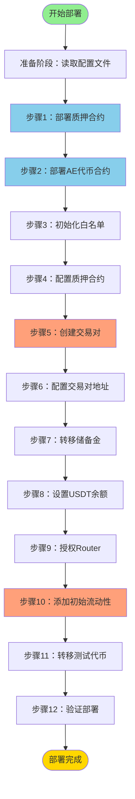

# AE 系统部署流程图

## 一、什么是部署？

**部署**就像是在区块链上"开店"的过程。我们要把 AE 代币系统（包括代币合约和质押合约）放到区块链上，让大家可以使用。

---

## 二、部署流程图



---

## 三、详细步骤说明

### 准备阶段：读取配置文件

**做什么：**
- 从 `ae-deployment-config.json` 文件中读取所有配置参数
- 就像开店前先看一遍"开店计划书"

**读取的内容包括：**
- BSC 链上的地址（USDT、PancakeSwap 路由器、工厂合约）
- 管理地址（营销地址、根地址、手续费接收者）
- 代币经济学参数（总供应量、储备金、初始流动性等）

---

### 步骤 1：部署质押合约 🏦

**做什么：**
把质押合约部署到区块链上。

**比喻：**
就像先建好一个"银行"，用户以后可以把代币存进来赚利息。

**需要的参数：**
- USDT 地址（用户质押时用的稳定币）
- Router 地址（用来兑换代币）
- 根地址（团队奖励的最终接收者）
- 手续费接收者（收取手续费的地址）

**结果：**
得到质押合约的地址，比如：`0x1234...abcd`

---

### 步骤 2：部署 AE 代币合约 🪙

**做什么：**
把 AE 代币合约部署到区块链上，并铸造所有代币。

**比喻：**
就像"印钞厂"开始印钱，一次性印出所有的 AE 代币（比如 1 亿个）。

**需要的参数：**
- USDT 地址
- Router 地址
- 质押合约地址（刚才部署的）
- 营销地址（收取买卖税的地址）

**结果：**
- 得到 AE 代币的地址
- 所有代币都在部署者的钱包里

---

### 步骤 3：初始化白名单 📋

**做什么：**
设置哪些地址可以免税交易。

**比喻：**
就像给"VIP 客户"发会员卡，他们买卖代币不用交税。

**白名单包括：**
- 部署者地址
- 质押合约地址
- 营销地址
- 交易对地址（稍后创建）

---

### 步骤 4：配置质押合约 🔗

**做什么：**
告诉质押合约"AE 代币的地址是什么"。

**比喻：**
就像告诉银行："我们银行只接受 AE 这种货币"。

**操作：**
调用 `staking.setAE(AE代币地址)`

---

### 步骤 5：创建 AE/USDT 交易对 🏪

**做什么：**
在 PancakeSwap 上创建一个 AE 和 USDT 的交易池。

**比喻：**
就像在交易所开一个"兑换窗口"，用户可以用 USDT 买 AE，或者用 AE 换 USDT。

**操作：**
调用 PancakeSwap 工厂合约的 `createPair()` 函数

**结果：**
得到交易对的地址（Pair 地址）

---

### 步骤 6：配置交易对地址 🔗

**做什么：**
告诉 AE 代币合约"交易对的地址是什么"。

**为什么重要：**
AE 代币需要知道交易对地址，才能：
- 对买卖交易收税
- 执行 recycle 机制（从池子回收代币）

**操作：**
调用 `ae.setPair(交易对地址)`

---

### 步骤 7：转移储备金到质押合约 💰

**做什么：**
把一大笔 AE 代币转到质押合约，作为奖励储备金。

**比喻：**
就像给银行存一大笔钱，用来支付用户的利息。

**数量：**
根据配置文件，比如 1500 万个 AE

**操作：**
调用 `ae.transfer(质押合约地址, 储备金数量)`

---

### 步骤 8：设置 USDT 余额 💵

**做什么：**
因为是测试环境（Fork 模式），需要给部署者"凭空变出"一些 USDT。

**比喻：**
就像在游戏里用作弊码给自己加钱。

**技术细节：**
- 使用 `hardhat_setStorageAt` 修改区块链存储
- 尝试不同的存储槽位（0, 1, 2, 51）找到 USDT 余额的位置
- 设置足够的 USDT 用于添加流动性

---

### 步骤 9：授权 Router 使用代币 ✅

**做什么：**
允许 PancakeSwap 的 Router 合约使用我们的 AE 和 USDT。

**比喻：**
就像给快递员授权："你可以从我这里拿走这些东西去送货"。

**操作：**
- 调用 `ae.approve(Router地址, AE数量)`
- 调用 `usdt.approve(Router地址, USDT数量)`

**为什么需要：**
Router 需要权限才能把我们的代币转到交易池里。

---

### 步骤 10：添加初始流动性 🌊

**做什么：**
往交易池里放入第一笔 AE 和 USDT，让交易可以开始。

**比喻：**
就像在"兑换窗口"里放入初始资金，比如 4000 万个 AE 和 4 万个 USDT。

**重要参数：**
- AE 数量：比如 40,000,000 AE
- USDT 数量：比如 40,000 USDT
- LP 代币接收者：
  - 如果配置为销毁（burnLP = true），发送到 `address(0)`，永久锁定流动性
  - 如果不销毁，发送到部署者地址

**初始价格：**
价格 = USDT 数量 / AE 数量 = 40,000 / 40,000,000 = 0.001 USDT/AE

**操作：**
调用 `router.addLiquidity()`

---

### 步骤 11：转移测试代币到测试钱包 🎁

**做什么：**
给测试钱包转一些 AE 代币，用于测试。

**比喻：**
就像给测试人员发一些"测试币"，让他们可以试用系统。

**数量：**
根据配置文件，比如 100 万个 AE

---

### 步骤 12：验证部署 ✔️

**做什么：**
检查所有代币是否分配正确。

**验证内容：**
- 部署者余额
- 质押合约余额（储备金）
- 流动性池余额（初始流动性）
- 测试钱包余额
- 总计是否等于总供应量

**保存信息：**
把所有部署信息保存到 `ae-deployment.json` 文件，包括：
- 合约地址
- 代币分配情况
- 部署时间
- 配置参数

---

## 四、代币分配示例

假设总供应量是 1 亿个 AE：

```
总供应量: 100,000,000 AE
├─ 质押合约储备金: 15,000,000 AE (15%)
├─ 初始流动性: 40,000,000 AE (40%)
├─ 测试钱包: 1,000,000 AE (1%)
└─ 部署者剩余: 44,000,000 AE (44%)
```

---

## 五、关键概念解释

### 1. 什么是流动性？

**简单理解：**
流动性就是交易池里的"货物"。池子里有 AE 和 USDT，用户才能买卖。

**例子：**
- 池子里有 4000 万个 AE 和 4 万个 USDT
- 用户想买 AE，就用 USDT 从池子里换
- 用户想卖 AE，就把 AE 放进池子换 USDT

### 2. 什么是 LP 代币？

**简单理解：**
LP 代币是"流动性凭证"，证明你往池子里放了钱。

**销毁 LP 的意义：**
- 如果销毁 LP（发送到 address(0)），流动性就永久锁定了
- 没人能把初始流动性取出来
- 保护投资者，防止项目方"抽地毯"（rug pull）

### 3. 什么是白名单？

**简单理解：**
白名单是"免税名单"，名单上的地址买卖代币不用交税。

**为什么需要：**
- 质押合约需要免税，否则用户质押时会损失一部分代币
- 部署者需要免税，方便添加流动性和测试

### 4. 什么是授权（Approve）？

**简单理解：**
授权就是允许别人使用你的代币。

**例子：**
- 你有 100 个 AE
- 你授权 Router 使用 50 个
- Router 才能帮你把这 50 个 AE 转到交易池

---

## 六、部署后的结果

部署成功后，你会得到：

1. **三个合约地址：**
   - AE 代币合约地址
   - 质押合约地址
   - AE/USDT 交易对地址

2. **一个配置文件：**
   - `ae-deployment.json`
   - 包含所有合约地址和部署信息

3. **一个可用的系统：**
   - 用户可以在 PancakeSwap 上买卖 AE
   - 用户可以质押 USDT 赚取 AE 奖励
   - 推荐系统和团队奖励已经就绪

---

## 七、常见问题

### Q1: 为什么要先部署质押合约，再部署代币合约？

**答：**
因为部署代币合约时需要知道质押合约的地址。就像盖房子要先打地基。

### Q2: 为什么要设置 USDT 余额？

**答：**
因为我们在测试环境（Fork 模式），部署者钱包里没有真实的 USDT。需要用特殊方法"变出"一些 USDT 用于添加流动性。

### Q3: 如果不销毁 LP 代币会怎样？

**答：**
如果不销毁，部署者可以随时取回流动性，导致交易池干涸，用户无法交易。销毁 LP 是对投资者的保护。

### Q4: 部署失败了怎么办？

**答：**
- 检查配置文件是否正确
- 检查网络连接是否正常
- 查看错误信息，根据提示修复
- 可以重新运行部署脚本

---

## 八、部署命令

```bash
# 1. 编译合约
npx hardhat compile

# 2. 启动本地测试网络（Fork BSC 主网）
npx hardhat node --hostname 0.0.0.0 --port 8545 --fork https://rpc.tornadoeth.cash/bsc

# 3. 部署 AE 系统（在另一个终端）
npx hardhat run scripts/deployAE.js --network localhost
```

---

## 九、总结

整个部署过程就像搭积木：

1. 先搭好"银行"（质押合约）
2. 再造出"货币"（AE 代币）
3. 然后开"兑换窗口"（交易对）
4. 最后放入"初始资金"（流动性）

每一步都环环相扣，缺一不可。部署完成后，整个 AE 生态系统就可以运转了！
